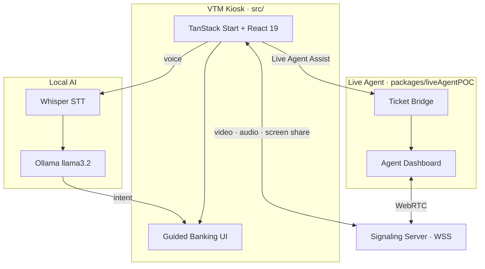

## The Spark

When I signed up for the OCBC Ignite Innovation Challenge 2025, our lecturer mentoring us dropped a line that stuck: before ATMs, there were human tellers. As a group of Gen Zs, that had honestly never crossed our minds — machines had always been the default. It reframed the whole problem. What if banking could be as natural as talking to a teller, but available 24/7? I pictured a Virtual Teller Machine where customers speak requests to a local AI, and escalate to a human agent with one click when needed.

I knew React and local AI, but I had never touched WebRTC. Learning an entire protocol in a weekend to ship real time video, audio, and screen sharing felt like the right kind of impossible. Larry Wall said the three virtues of a great programmer are laziness, impatience, and hubris. This one was pure hubris.

## The Build

The OCBC VTM is a smart banking kiosk. Customers speak their request; Whisper transcribes it in the browser, a local LLM classifies the intent, and the UI responds with guided workflows for remittances or loan enquiries. When self service fails, one click escalates to a live agent over WebRTC with screen sharing and real time annotations so they can literally point at the problem.

I chose local AI for privacy (voice data never leaves the machine) and resilience (it works offline). I used a monorepo so I could spin up the entire stack with one command, letting judges see the full flow immediately.

## The Security Nightmare

The biggest challenge was not WebRTC itself; it was making it secure. Everything worked on localhost with HTTP, but the moment we switched to HTTPS for camera access, the system collapsed. My teammate and I spent an entire night debugging why connections would initialise but never establish.

The root cause was a cascade of security requirements I did not understand: HTTPS for the UI, WSS for the signalling server, HTTPS for the dashboard, and valid TLS certificates for all three, even in local development. Discovering mkcert helped, but wiring each service correctly took until 4 AM. When the agent video finally appeared, the relief was immediate.

## The Result

We didn't win the hackathon, but a teammate and I walked away with internship offers. Now I get to work on the actual mobile banking app that millions of customers use every day.
